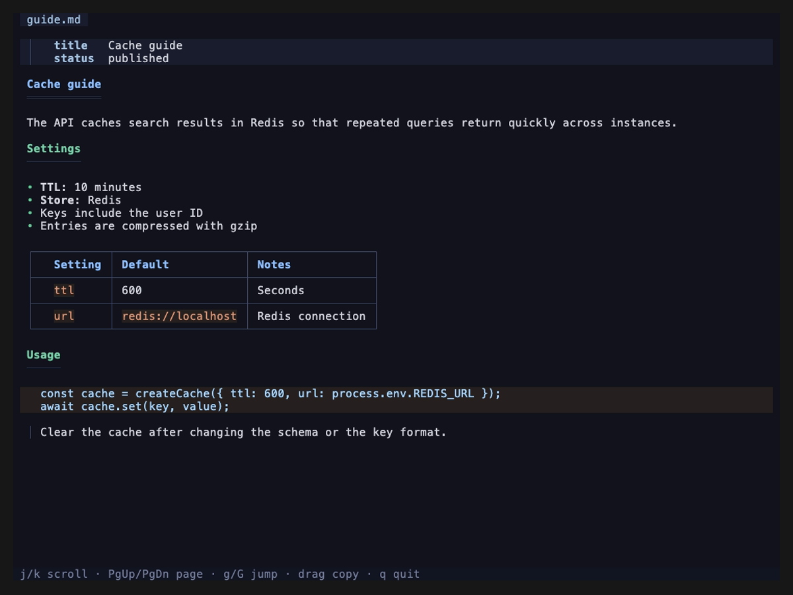
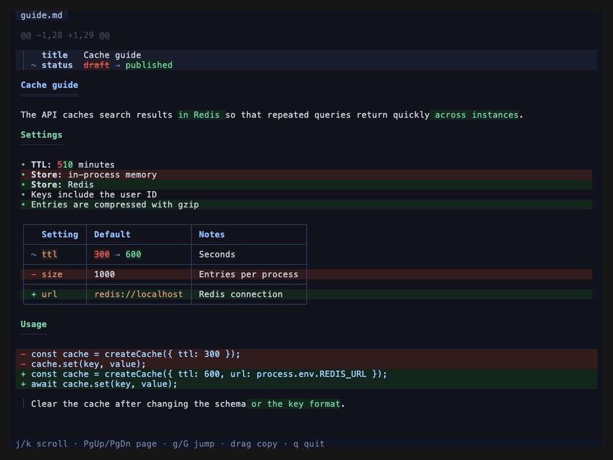

# mdcat

Render Markdown files and Markdown diffs as rich text in the terminal. In a diff, added blocks are green, removed blocks are red, and edited paragraphs, list items, and table cells show inline word diffs.

| `mdcat guide.md` | `mdgit diff` |
| --- | --- |
|  |  |

## Installation

Supported runtimes:

- Bun 1.3 or later
- Node.js 26.4 or later

```sh
bun install -g @shqld/mdcat
# or
npm install -g @shqld/mdcat
```

The installed commands start with Node.js. To run them with Bun, pass the file to Bun, for example `bun $(which mdcat) README.md`.

## Usage

### mdcat

`mdcat` renders Markdown files. With no file, it reads stdin and renders it as a diff when it contains one, or as a Markdown document otherwise.

```sh
mdcat README.md docs/*.md
cat README.md | mdcat
git diff | mdcat
```

### mdgit

`mdgit diff` and `mdgit show` take the same arguments as `git diff` and `git show`, and render only the Markdown files in the result.

```sh
mdgit diff
mdgit diff --cached
mdgit diff HEAD~3..HEAD -- docs/
mdgit show HEAD~1
mdgit show HEAD:docs/guide.md
```

### Keys

Scroll with the arrow keys or `j`/`k`, jump with `g`/`G`, and quit with `q`. Dragging selects and copies text. Click a `<details>` summary to toggle it.

## Development

```sh
bun install
bun run check
```

To release, bump the version, then publish a GitHub release for the tag; GitHub Actions publishes it to npm:

```sh
npm version patch
git push --follow-tags
gh release create "v$(jq -r .version package.json)" --generate-notes
```

## License

MIT
